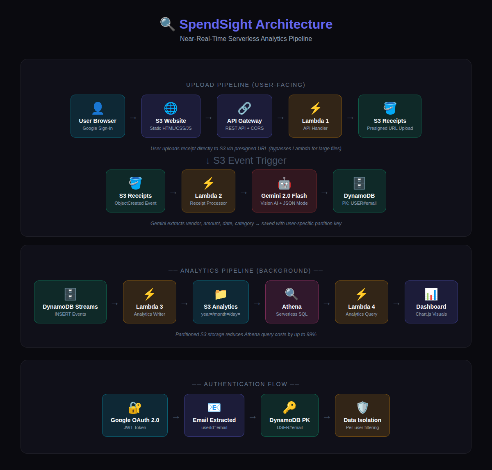

# SpendSight

AI-powered personal expense tracker built on AWS serverless architecture with Google Gemini Vision AI.



## Features

- Receipt scanning with Gemini 2.0 Flash Vision AI
- Manual expense entry with category classification
- Google OAuth 2.0 authentication (multi-user)
- Real-time analytics dashboard with Chart.js
- Near-real-time analytics pipeline via DynamoDB Streams
- User-segmented data isolation

## Architecture

```
Upload Pipeline:
Browser → S3 Website → API Gateway → Lambda → S3 → Lambda → Gemini AI → DynamoDB

Analytics Pipeline:
DynamoDB Streams → Lambda → S3 (Partitioned) → Athena → Lambda → Dashboard
```

## Tech Stack

| Layer | Technology |
|-------|-----------|
| Frontend | HTML, CSS, JavaScript, Chart.js |
| Auth | Google OAuth 2.0 |
| API | AWS API Gateway + Lambda (Python) |
| OCR | Google Gemini 2.0 Flash Vision AI |
| Database | Amazon DynamoDB |
| Analytics | DynamoDB Streams → Lambda → S3 → Athena |
| Hosting | Amazon S3 Static Website |
| Monitoring | AWS CloudWatch |

## Project Structure

```
spendsight/
├── frontend/
│   ├── index.html              # Upload page with Google Sign-In
│   └── dashboard.html          # Analytics dashboard
├── lambda/
│   ├── api_handler/            # POST /upload-url, GET/POST /expenses
│   ├── receipt_processor/      # S3 trigger → Gemini AI → DynamoDB
│   ├── analytics_writer/       # DynamoDB Streams → S3 partitioned
│   └── analytics_query/        # Athena SQL → dashboard API
├── athena/
│   └── setup.sql               # CREATE TABLE + sample queries
└── docs/
    ├── architecture.png
    ├── SpendSight_Documentation.docx
    ├── SpendSight_Presentation.pptx
    └── Speaking_Script.md
```

## AWS Services

- **S3** — Static website hosting, receipt storage, analytics data lake
- **Lambda** — 4 serverless functions (API, OCR, Writer, Query)
- **API Gateway** — REST API with CORS
- **DynamoDB** — NoSQL database with Streams enabled
- **Athena** — Serverless SQL on partitioned S3 data
- **CloudWatch** — Logging and monitoring

## Setup

### Prerequisites

- AWS Account (free tier)
- Google Cloud account with Gemini API key
- Google OAuth 2.0 Client ID

### 1. S3 Buckets

Create three S3 buckets:
- `expense-website-pratham-2026` — Enable static website hosting, upload frontend files
- `expense-reciepts-pratham-2026` — Receipt image storage
- `expense-analytics-pratham-2026` — Analytics data lake

### 2. DynamoDB

Create table `ExpensesTable`:
- Partition Key: `PK` (String)
- Sort Key: `SK` (String)
- Enable DynamoDB Streams (NEW_IMAGE)

### 3. Lambda Functions

Deploy each Lambda from the `lambda/` directory:

| Function | Trigger | Env Variables |
|----------|---------|---------------|
| api_handler | API Gateway | `RECEIPT_BUCKET`, `TABLE_NAME` |
| receipt_processor | S3 ObjectCreated | `TABLE_NAME`, `GEMINI_API_KEY` |
| analytics_writer | DynamoDB Streams | `ANALYTICS_BUCKET` |
| analytics_query | API Gateway | `ATHENA_DATABASE`, `ATHENA_OUTPUT_LOCATION` |

### 4. API Gateway

Create REST API with routes:
- `POST /upload-url` → api_handler Lambda
- `GET /expenses` → api_handler Lambda
- `POST /expenses` → api_handler Lambda
- `GET /analytics` → analytics_query Lambda
- Enable CORS on all resources
- Deploy to `demo` stage

### 5. Athena

Run `athena/setup.sql` in the Athena console to create the database and table.

### 6. Google OAuth

- Create OAuth Client ID in Google Cloud Console
- Add S3 website URL to Authorized JavaScript Origins
- Update `GOOGLE_CLIENT_ID` in both HTML files

### 7. Gemini API

- Get API key from Google AI Studio or Cloud Console
- Enable Generative Language API
- Link billing account for quota
- Set as `GEMINI_API_KEY` env var in receipt_processor Lambda

## DynamoDB Schema

| Attribute | Example | Purpose |
|-----------|---------|---------|
| PK | USER#pratham@gmail.com | User partition |
| SK | DATE#2026-02-08#TS#1770524850817 | Date-sorted queries |
| vendor | Starbucks | AI-extracted merchant |
| amount | 38.02 | Total (Decimal) |
| category | Food | AI-classified category |

## Cost

All services within AWS free tier for demo usage. Gemini API covered by Google Cloud $300 credit.

## Security

- IAM least privilege roles per Lambda
- Presigned URL uploads (bypass Lambda)
- Google OAuth 2.0 authentication
- User data isolation via DynamoDB partition keys
- S3 server-side encryption

## Author

Pratham Shah — February 2026
